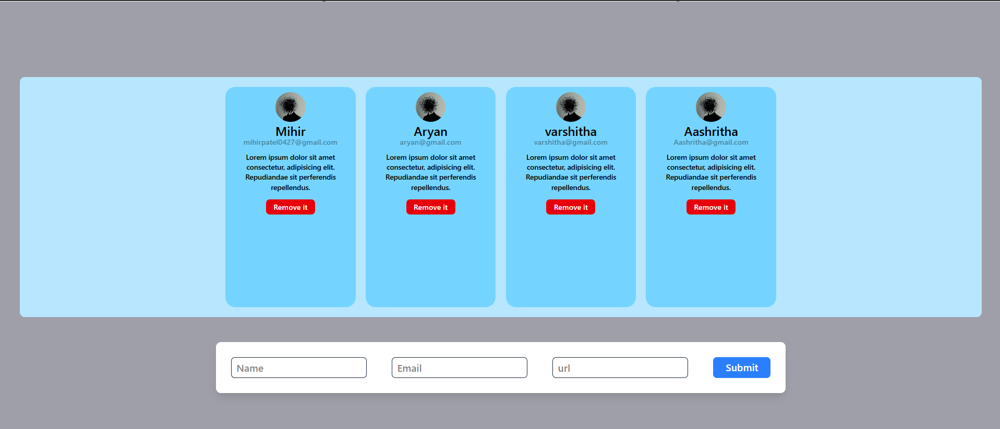

# Profile Forms Project

A React application built with Vite that demonstrates form handling, state management, and dynamic card creation. This project serves as a learning reference for implementing common React patterns and features.

## 🛠 Tech Stack

- React 18.3
- Vite 6.0
- TailwindCSS 4.0
- React Hook Form 7.54
- ESLint

## 🎯 Key Features

- Form handling with React Hook Form
- Dynamic card creation and removal
- Responsive design with TailwindCSS
- Real-time form data management
- Image URL integration

## 💡 Learning Points

### React Hook Form Implementation
```jsx
const {register, handleSubmit, reset} = useForm();
```
- Used for efficient form handling
- Built-in form validation
- Automatic form reset after submission

### State Management
```jsx
const [users, setUsers] = useState([]);
```
- Array state management for user cards
- Dynamic updates using spread operator
- State lifting for component communication

### Component Structure
- `App.jsx`: Main container component
- `Form.jsx`: Form handling component
- `Cards.jsx`: Card container component
- `Card.jsx`: Individual card component

### TailwindCSS Usage
- Responsive design classes
- Flex layout implementation
- Custom styling with utility classes

## 🚀 Getting Started

1. Clone the repository
```bash
git clone <repository-url>
```

2. Install dependencies
```bash
npm install
```

3. Run development server
```bash
npm run dev
```

## 📝 Code Examples

### Form Submission
```jsx
const handleFormSubmitData = (data) => {
    handleFormSubmit(data);
    reset();
}
```

### Card Removal
```jsx
const handleRemove = (id) => {
    setUsers(() => users.filter((item, index) => index != id));
};
```

## 📸 Screenshots



## 🎥 Demo

<div align="center">
  
</div>

## 📚 Key Takeaways

1. Form handling best practices with React Hook Form
2. State management patterns in React
3. Component composition and props drilling
4. TailwindCSS implementation strategies
5. Dynamic component rendering

